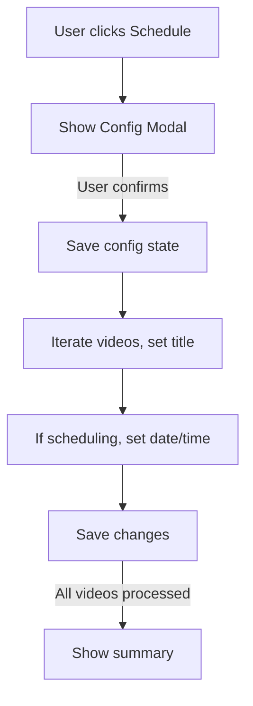
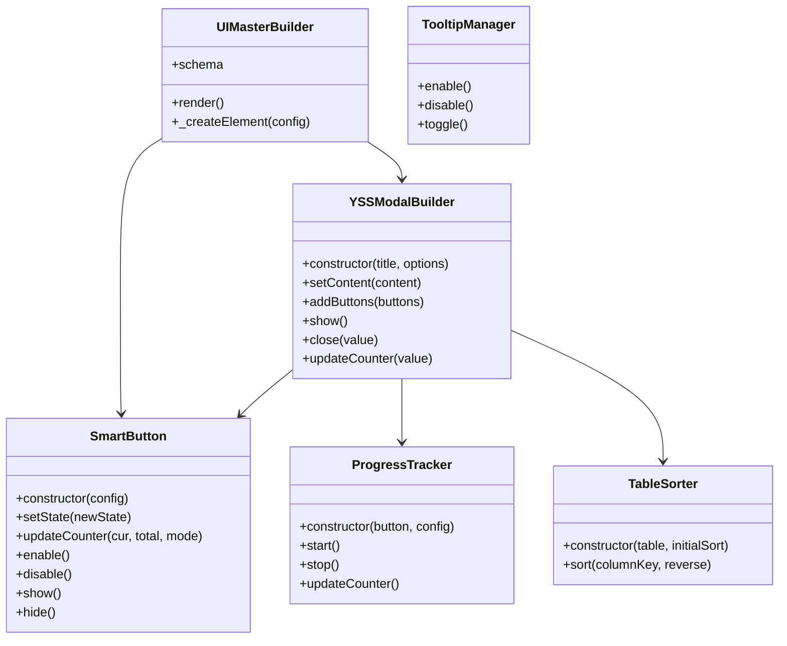
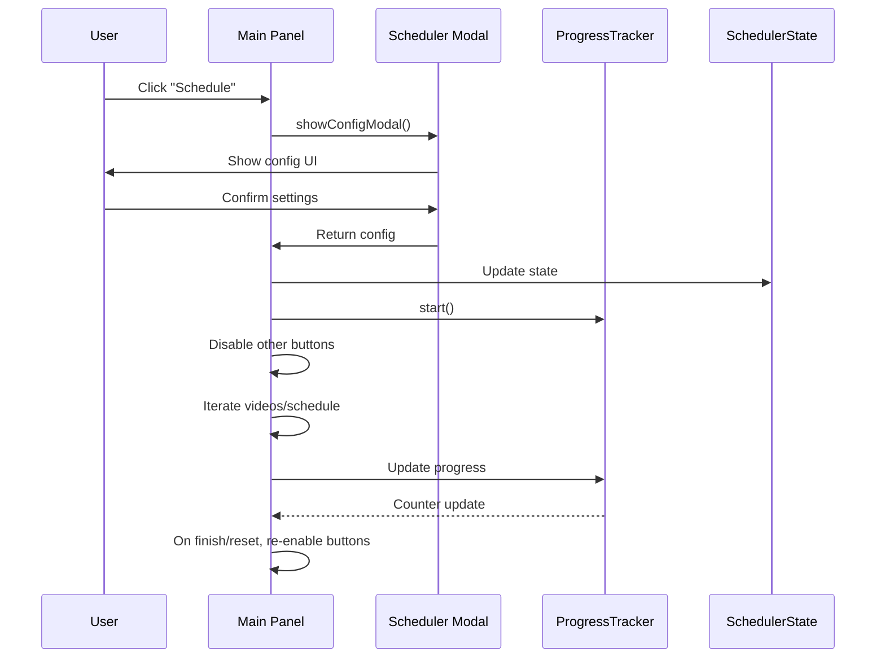

# YouTube Studio Toolpanel 
**Version:** v3.10.4  
**Author:** SatoshiSea

---
[](https://github.com/SatoshiSea)
[](https://opensource.org/licenses/MIT)
[](https://www.tampermonkey.net/)
---
A powerful, extensible, multi-tool UserScript UI for YouTube Studio. It automates mass scheduling, renaming, notifications management, scraping, uploading, downloading, calendar sync, and more.  
This documentation covers the entire architecture, UI, feature usage, and developer extension guidance.

---
<table cellpadding="0" cellspacing="0" font-size="10">
  <tbody>
    <tr>
        
    </tr>
  <tr>
    <td cellpadding="10">
      
    </td>    
    <td cellpadding="10">
      
    </td>
  </tr>
    <tr>
    <th font-size="11">Toolpanel  full view</th> 
    <th font-size="11">Toolpanel in no-text buttons  mode(compact mode)</th>
  </tr>
  <tr>
    <td cellpadding="10">
     
    </td>    
    <td cellpadding="10">
      
    </td>
  </tr>
  <tr>
    <th font-size="11">Scheduler configuration modal.</th>
    <th font-size="11">Help Modal Popup</th> 
  </tr>
    <tr>
    <td cellpadding="10">
     
    </td>    
    <td cellpadding="10">
      
    </td>
  </tr>
  <tr>
    <th font-size="11">Scraper calendar view.</th>
    <th font-size="11">Calendar day detail</th> 
  </tr>
     <tr>
    <td cellpadding="10">
     
    </td>    
    <td cellpadding="10">
      
    </td>
  </tr>
  <tr>
    <th font-size="11">BulkDownloader Modal</th>
    <th font-size="11">Downloader Reference File Management</th> 
  </tr>
     <tr>
    <td cellpadding="10">
     
    </td>    
    <td cellpadding="10">
      
    </td>
  </tr>
  <tr>
    <th font-size="11">BulkUploader Modal File selection</th>
    <th font-size="11">BulkUploader Modal History </th> 
  </tr>
  </tbody>
</table>

## 🚩 The Main Panel

The main panel is an overlay UI injected into YouTube Studio (`studio.youtube.com`) and compatible domains.

- **Floating, draggable, and resizable panel.**
- **Buttons are context-aware:** Only relevant tools are enabled, based on your current filter (e.g., Unlisted, Draft, Scheduled).
- **Collapsible and supports "Icon-Only" mode** for compact display.

**Key actions include:**
- Bulk schedule/rename videos
- Un-draft and schedule
- Unlist Premieres
- Scrape video titles or export CSV
- Disable notifications across all videos
- Bulk download/upload
- Calendar view and sync

### Main Panel Features

| Feature                    | Description                                                | Context/Filter        |
|----------------------------|------------------------------------------------------------|-----------------------|
| Schedule/Rename            | Bulk schedule or rename videos                             | Unlisted, Draft, ...  |
| Un-Draft / Draft-to-Schedule | Publish drafts as unlisted and optionally schedule them   | Draft                 |
| Unlist Premieres           | Change scheduled Premieres to Unlisted                     | Scheduled             |
| Scrape Titles/CSV Export   | Extract video titles or export CSV (with optional times)    | All                   |
| Disable All Notifications  | Automate unchecking "Notify Subscribers"                   | Unlisted, others      |
| Bulk Downloader/Upload     | Download or upload multiple videos                         | All                   |
| Calendar View              | Visualize schedule/export data                             | All                   |

---

## 🧠 Context-Aware Controls

Buttons are only enabled if your YouTube Studio filter matches the operation's requirements. For example:

- **Schedule/Rename**: Enabled when "Unlisted" or "Draft" filter is selected.
- **Unlist Premieres**: Enabled when "Scheduled" filter is selected.
- **Disable All Notifs**: Enabled with "Unlisted" filter.

Hovering disabled buttons shows a tooltip explaining the required filter.

---

## 📅 Scheduler & Renamer

Bulk schedule videos or rename them (with or without scheduling).

- **Scheduler Modal:** Lets you set start date/time, interval type (predefined/custom), and provide manual titles or auto-generate them via a pattern (`{num}`).
- **Rename-Only Mode:** If enabled, only renames videos, skipping scheduling.
- **Bulk Search/Replace:** Replace any word/string in all visible video titles across pages.

### Scheduler Process Flow



- **State is persisted:** Progress can be resumed after interruption.
- **Safe:** Only processes visible, filtered videos.

---

## 🚀 Un-Draft & Draft-to-Schedule

### Un-Draft

- Publishes all draft videos as Unlisted in bulk.

### Draft-to-Schedule

- Combines "Un-Draft" and "Scheduler" in one pass:
    1. Publishes drafts as Unlisted.
    2. Filters to Unlisted.
    3. Schedules them according to your configuration.

**Progress is tracked and resumable.**

---

## 👁️‍🗨️ Un-List Premieres

- Bulk-converts all "Premiere" (scheduled) videos to "Unlisted" status.
- Requires "Scheduled" filter.

---

## 📝 Scrapers (Titles & CSV Export)

### Scrape Titles

- Extracts all video titles currently visible (across all pages).
- Animated, real-time UI shows progress, stats, and allows copy/clear.

### CSV Export

- Exports all video metadata to CSV.
- Optionally includes scheduled time (slower, requires opening each video).
- Data ready for calendar visualization or external use.

---

## 🔕 Disable All Notifications

- Scans all videos, auto-unchecks the "Notify Subscribers" option.
- Works across multiple pages.
- Tracks queue, processed videos, and supports pause/resume and manual intervention.
- **Manual selection mode:** Pick specific videos to process.

---

## ⬇️⬆️ Bulk Downloader & Uploader

### Bulk Downloader

- Scrape download links for all videos matching filter/search.
- Pre-fetch mode: Scan all pages, compare to existing files, exclude duplicates.
- Live mode: Download current page videos.
- Import/export download lists.
- Retry/failure tracking, robust against YouTube UI changes.

#### Bulk Downloader: Modes and Features

- Modes:
  - Live Processing: Process only the current page. Avoids navigation.
  - Pre-fetch & Compare: Scan all pages, collect download URLs, compare with imported files, and confirm downloads.
  - Pre-fetch Only: Scan and export all download URLs without downloading. Use later for safe batch downloads.
  - Manual Selection: Pick specific videos on the page. Then run targeted downloads.
- Features:
  - Duplicate Avoidance: Compares normalized titles against imported filenames.
  - URL Import/Export: Save or load JSON/CSV lists of videos and links.
  - Retry and Failure Tracking: Retries failed downloads up to 3 times.
  - Progress Control: Pause/stop, concurrent limits, and queued downloads.
  - History and Summary: Persist success/failure, and show sortable summaries.

### Bulk Uploader

- Supports batch uploads (e.g., 15 files at a time).
- Progress bar and detailed history tracking.
- Avoids duplicate uploads by comparing filenames.

#### Bulk Uploader: Detailed Features

- File Queue and Batching:
  - Batch size default is 15 files per run.
  - Multi-batch runs wait between batches for UI stabilization.
- Duplicate Detection and History:
  - Checks GM history for previously successful uploads.
  - Warns when attempted files were uploaded before.
- Resumable Flow:
  - Auto-continue batches via YSS_UPLOADER_BATCH_INDEX if present.
  - Supports cancel/stop from the mini indicator.
- UI/Controls:
  - Select files, clear queue, and view upload history.
  - Shows duplicates count and per-file delete in modal list.
- Robust Monitoring:
  - Tracks mini-indicator status text to classify success/failure.
  - Uses tolerant polling with safe timeouts.
---

## 📆 Calendar Sync Feature

- **Calendar Modal:** Visualizes scheduled/exported videos in a monthly grid.
- **Sync with [satsea.io/video-calendar](https://satsea.io/video-calendar):**
    - One-click sync exports your CSV to the calendar viewer.
    - Full two-way bridge via GM storage and events.

---

## 🛠️ Developer's Guide: Modifying the Script

### Core Architecture

#### State Management

- Each process (scheduler, renamer, uploader, etc.) maintains its own state object.
- Global states are used for UI, log areas, and modal references.

#### Centralized Process Management

- **setActiveProcess(processName):** Sets the active process, updates UI, and starts progress tracking.
- **clearActiveProcess():** Resets active process and UI.

#### UI Construction System

<div style="background:#f7f7f7;border-left:4px solid #777;padding:1em 0.5em;color:black;">
<strong>Key Builders:</strong>
<ul>
<li><b>UIMasterBuilder</b>: Declarative, schema-based main panel construction.</li>
<li><b>YSSModalBuilder</b>: Modal dialog builder with header, footer, draggable, back/close, stats, counter, and flexible content.</li>
<li><b>SmartButton System</b>: Buttons with states (pause/resume, start/stop), icons, counters, and centralized management.</li>
<li><b>External Hosted Stylesheet/b>: For performance reasons, the css styles are embedded in an external stylesheet from a raw css file  on  a github reposiitory. styles  can be  injected in GM_addstyle, but its better to keep the styles on the external file.</li>
</ul>
</div>

#### Utility Classes & Managers

- **ProgressTracker:** Tracks progress of multi-page bulk operations.
- **TableSorter:** Makes tables sortable by column, with numeric and natural sorting.
- **TooltipManager:** Enhanced, anti-overlap tooltips with arrow positioning.
- **ContentBuilder:** Programmatic, schema-based HTML generator.

---

### 1. UIMasterBuilder

Responsible for building the main floating panel.  
Takes a declarative schema with nested containers, sections, rows, buttons, checkboxes, and custom elements.

**Example usage:**

```js
const uiSchema = {
  type: 'container',
  id: 'yss-panel',
  className: 'yss-panel',
  children: [
    { type: 'custom', render: _createPanelHeader },
    // ... other UI rows and elements ...
  ]
};
const panel = new UIMasterBuilder(uiSchema).render();
document.body.appendChild(panel);
```

---

### 2. YSSModalBuilder

Builds and shows modals for configuration, progress, summaries, etc.

- Supports draggable, sticky modal.
- Header with title/counter/back/close.
- Actions bar (left/right).
- Central content area.
- **Methods:** `setContent()`, `addButtons()`, `show()`, `close()`, `updateCounter()`, etc.

**Example:**

```js
const modal = new YSSModalBuilder('Bulk Scheduler Configuration', { isSticky: true, maxWidth: '600px' });
modal.setContent([configForm]).addButtons([confirmBtn, cancelBtn]);
modal.show().then(config => { /* ... */ });
```

---

### 3. SmartButton System

All buttons (panel and modal) are "smart":  
- Can have multiple states: start/stop, pause/resume, etc.
- State change updates icon, text, tooltip, CSS.
- Centralized configuration for all buttons.

**Example:**

```js
const startBtn = createSmartButton({
  id: 'yss-start-stop-btn',
  text: 'Schedule',
  icon: 'fa-regular fa-calendar-check',
  classes: ['yss-btn', 'yss-btn-start'],
  handlers: { onClick: onSchedulerStartStopClick },
  showCounter: true
});
```

---

## 🛎️ Utility Classes & Managers

### ProgressTracker

- Attaches to a SmartButton.
- Listens to log entries or DOM changes.
- Shows numeric or percent progress on the button.
- Supports pre-scan (counts total videos across pages before starting).

### TableSorter

- Makes any HTML table sortable by clicking headers.
- Supports `data-sort-key` attributes, numeric, and text sorting.

### TooltipManager

- Replaces all tooltips with a smart, arrowed tooltip system.
- Avoids overlaps, adjusts on viewport resize, supports dynamic content.

### ContentBuilder

- Declarative HTML creation for modals, instructions, and help.
- Used in help modals, manual selection instructions, etc.

---

## ✨ How to Add a New Feature (Example)

Suppose you want to add a **"Bulk Private"** button to set all filtered videos to Private:

1. **Define State:**
   ```js
   const bulkPrivateState = { isRunning: false, stop: false };
   ```

2. **Add Button to UI Schema:**
   ```js
   { type: 'button', id: 'yss-bulk-private-btn', label: 'Bulk Private', onClick: onBulkPrivateClick }
   ```

3. **Button Config (in BUTTON_CONFIG):**
   ```js
   'yss-bulk-private-btn': {
     icon: 'fa-solid fa-lock',
     tooltip: 'Set all filtered videos to Private'
   }
   ```

4. **Implement Logic:**
   ```js
   async function onBulkPrivateClick() {
     bulkPrivateState.isRunning = true;
     // Iterate video rows, open options, set to private, save
     bulkPrivateState.isRunning = false;
   }
   ```

5. **Register in processConfig if progress tracking is needed.**

6. **Done!** The new button appears, with icons, tooltips, and state management.

---
## 🏗️ Core Architecture (Class Diagram)



---

## 🔀 Data & Process Flow (Sequence Diagram)

**Example: Bulk Schedule Process**



---

## 🔧 Developer Console Functions

For advanced users/developers, run these functions in the browser console:

| Function | Purpose |
|---|---|
| `debugDownloaderStorage()` | Inspect localStorage for downloader data |
| `clearCorruptedDownloaderData()` | Remove broken/corrupted download data |
| `showImportedFilesModal()` | Modal: View and manage imported files |
| `clearImportedFilesFromStorage()` | Remove all imported file data |
| `showPrefetchData()` | Show last prefetch data comparison modal |
| `clearPrefetchData()` | Remove prefetch data |
| `debugManualSelection()` | Simulate manual video selection mode |
| `debugVideoIdExtraction()` | Test video ID extraction on all rows |

---

## 🧑‍💻 API Endpoints

*No explicit HTTP API endpoints are present in this script.  
All operations are handled client-side via DOM, GM storage, and user interface.*

---

## 📖 How to Troubleshoot or Extend

- Use the **log area** in the panel for info, warnings, and errors.
- All long-running actions are cancelable and show progress.
- Each process is encapsulated, and new bulk operations can be added following the existing architecture.

---

## 🏁 Summary Table of Features

| 🛠️ Tool/Feature           | Description                                                            | Context Filter / Precondition             |
|---------------------------|------------------------------------------------------------------------|-------------------------------------------|
| Schedule/Rename           | Bulk schedule or rename filtered videos                                | "Unlisted" or "Draft" filter              |
| Un-Draft                  | Publish all draft videos as Unlisted                                   | "Draft" filter                            |
| Draft-to-Schedule         | Un-draft, then schedule all videos in one operation                    | "Draft" filter                            |
| Unlist Premieres          | Set all scheduled "Premiere" videos to Unlisted                        | "Scheduled" filter                        |
| Scrape Titles             | Extract all video titles, copy/export                                  | Any                                       |
| CSV Export                | Export video data to CSV, with optional scheduled time                 | Any                                       |
| Disable All Notifications | Uncheck "Notify Subscribers" on all videos                             | "Unlisted" or as chosen                   |
| Bulk Downloader           | Download all matching videos, skip duplicates, multi-mode              | Any                                       |
| Bulk Uploader             | Upload batches of files, progress-tracked                              | Any                                       |
| Calendar Sync             | Visualize schedule/export in a calendar, sync to [satsea.io](https://satsea.io/video-calendar) | Any |
| Manual Selection          | Select specific videos for targeted bulk actions                       | Any (enabled in multiple features)         |

---

## 🧑‍💻 Developer’s Notes

- **Adding new features:**  
  - Define a state object.
  - Add UI button to schema.
  - Register in `BUTTON_CONFIG`.
  - Implement logic function.
  - If needed, register in `processConfig` for progress tracking.

- **UI best practices:**  
  - Use `YSSModalBuilder` and `SmartButton` for all modals and buttons.
  - Use centralized process management for running state, disabling/enabling relevant controls.
  - Use ProgressTracker for multi-page/bulk operations.

- **Debugging:**  
  - Use the log area and browser console.
  - All significant actions are logged with timestamp and severity.
  - Many debug functions are available globally.

---

## 🧩 Example: Adding a New Bulk Action

Suppose you want to add a "Bulk Set Videos to Private" action:

1. Define a state object:
   ```js
   const bulkPrivateState = { isRunning: false, stop: false };
   ```
2. Add a button to the UI schema:
   ```js
   { type: 'button', id: 'yss-bulk-private-btn', label: 'Bulk Private', onClick: onBulkPrivateClick }
   ```
3. Register in `BUTTON_CONFIG`:
   ```js
   'yss-bulk-private-btn': { icon: 'fa-solid fa-lock', tooltip: 'Set videos to Private' }
   ```
4. Implement the click logic:
   ```js
   async function onBulkPrivateClick() {
    // Iterate all video rows, open options, set visibility, save.
   }
   ```
5. Add to `processConfig` if you want progress tracking.

---

## 🧑‍🔧 Dependencies

- **FontAwesome** for icons.
- **Violentmonkey/Tampermonkey** for GM_* API (storage, resource, cross-tab messaging).
- **No heavy frameworks:** Pure vanilla JavaScript for maximum compatibility.

---
## 🗃 Selector Maintenance and Update Guide

**IMPORTANT:**  
YouTube frequently changes its UI and underlying CSS selectors.  
THE TOOLPANEL'S SELECTORS ARE CENTRALIZED and easy to update per feature.

#### **Bulk Uploader**

- **openUploadDialog()** (main entry for opening the upload dialog)
    ```js
    const CREATE_BUTTON_SELECTOR = 'ytcp-button#create-icon, .ytcpAppHeaderCreateIcon';
    const CREATE_MENU_CANDIDATE_SELECTOR = 'ytcp-text-menu#creation-menu, .ytcpAppHeaderCreationMenu';
    const UPLOAD_MENU_ITEM_SELECTOR = 'tp-yt-paper-item[test-id="upload-beta"], ytcp-text-menu-item#upload-video, ytcp-text-menu-item[role="menuitem"]:nth-child(1), .ytcpAppHeaderUploadVideoMenuItem';
    const UPLOAD_DIALOG_CANDIDATE_SELECTOR = 'ytcp-uploads-dialog, ytcp-uploads-dialog[open], .yss-upload-dialog';
    ```
- **uploadFileBatch()** (for file input)
    ```js
    const UPLOADS_FILE_INPUT_SELECTOR = 'input[type="file"][name="Filedata"]';
    ```
- **monitorUploadProgress()** (to monitor upload progress, indicator)
    ```js
    const UPLOADS_MINI_INDICATOR_SELECTOR = 'ytcp-uploads-mini-indicator';
    const UPLOADS_PROGRESS_MONITOR_CLOSE_BTN_SELECTOR = 'ytcp-multi-progress-monitor #close-button';
    const UPLOADS_PROGRESS_MONITOR_HEADER_SELECTOR = 'ytcp-multi-progress-monitor .header span.count';
    ```

#### **Bulk Downloader**

- **extractDownloadUrl()/downloadVideoForRow()** (menu & download links)
    ```js
    const optionsSelectors = [
      'ytcp-icon-button[aria-label="Options"]',
      'ytcp-icon-button#options-menu',
      'ytcp-icon-button[tooltip="Options"]',
      'button[aria-label="Options"]',
      'ytcp-icon-button > yt-icon[icon="more_vert"]',
      // ...more patterns
    ];
    const menuListboxSelector = 'tp-yt-paper-listbox#paper-list[role="menu"]';
    const downloadItemSelector = 'tp-yt-paper-item[test-id="download"]';
    const downloadAnchorSelector = 'a[href*="/download_my_video"]';
    ```

#### **Disable Notifications**

- **handleVideoEditPage()** and helpers
    ```js
    const showMoreSelector = '#toggle-button';
    const notifyCheckboxSelector = 'ytcp-checkbox-lit#notify-subscribers';
    const saveSelectors = [
      '#save:not([disabled])',
      '#save-button:not([disabled])',
      'button[aria-label*="Save"]:not([disabled])',
      'button[data-tooltip*="Save"]:not([disabled])',
      'button[title*="Save"]:not([disabled])'
    ];
    ```

#### **Unlister & Scheduler**

- **handleUnlistPopup()**, **handleSchedulerPopup()**, **handleDatePicker()**, **handleTimePicker()**
    ```js
    const visibilityPopupSelector = 'ytcp-video-visibility-edit-popup';
    const expandFirstSelector = '#first-container-expand-button';
    const unlistedRadioSelector = 'tp-yt-paper-radio-button[name="UNLISTED"]';
    const saveButtonSelector = '#save-button';
    const dateTriggerSelector = '#datepicker-trigger';
    const scheduleContainerSelector = '#second-container';
    const timeInputSelector = 'ytcp-video-visibility-edit-popup:not([style*="display: none"]) ytcp-datetime-picker tp-yt-paper-input#textbox input';
    const premiereCheckboxSelector = '#schedule-type-checkbox #checkbox';
    ```

#### **Draft Publisher**

- All workflow step selectors and constants are grouped under the `SELECTORS` section:
    ```js
    const VIDEO_ROW_SELECTOR = 'ytcp-video-row';
    const DRAFT_MODAL_SELECTOR = 'ytcp-uploads-dialog';
    const DRAFT_BUTTON_SELECTOR = '.edit-draft-button';
    const RADIO_BUTTON_SELECTOR = 'tp-yt-paper-radio-button';
    const NEXT_BUTTON_SELECTOR = '#next-button';
    const SAVE_BUTTON_SELECTOR = '#done-button';
    const VISIBILITY_PAPER_BUTTONS_SELECTOR = 'tp-yt-paper-radio-group#privacy-radios';
    const NOTIFY_SUBSCRIBERS_CHECKBOX_SELECTOR = 'ytcp-checkbox-lit#notify-subscribers';
    const SHARE_MODAL_DIALOG_SELECTOR = 'ytcp-video-share-dialog:not([style*="display: none"]), ytcp-video-share-dialog';
    ```

#### **CSV Scraper**

- **csv_* helpers** for titles & time extraction:
    ```js
    const rowSelector = 'ytcp-video-row';
    const titleSelector = 'a#video-title span';
    const visibilityEditSelector = '.tablecell-visibility .icon-text-edit-triangle-wrap.editable';
    const nextButtonSelector = '#navigate-after:not([disabled])';
    const timeInputInPopup = 'ytcp-video-visibility-edit-popup:not([style*="display: none"]) ytcp-datetime-picker tp-yt-paper-input#textbox input';
    ```

**Selector Update Process:**
- If buttons stop working, **first update the selectors in these functions**.
- Use browser inspection tools to find new class names or structures.
- Prefer tolerant selectors (e.g. `[aria-label*="Options"]`, `[data-tooltip*="Save"]`).
- Test with debug functions in the browser console to verify extraction logic.
- Update constants near their respective functions to minimize impact.

---

## ⚙️ Dependencies

- **FontAwesome**: For all icons
- **Violentmonkey/Tampermonkey**: For GM_* APIs (storage, cross-tab communication, resource management)
- **No external frameworks**: 100% vanilla JavaScript for performance and compatibility

---

## 🆘 Troubleshooting

- **Buttons not enabled?**  
  Make sure your Content filter matches the tool’s requirements.
- **Bulk operations slow/stuck?**  
  Keep the tab focused and do not navigate away until the operation completes.
- **Tooltips/icons missing?**  
  Wait for UI to finish loading; reload if needed.
- **Process stuck?**  
  Use reset/stop/clear buttons, reload page; progress is saved.
- **Selector breakage after YouTube update?**  
  Update selectors in the relevant section as described above.
---
## 🏁 Final Note

This script is robust, modular, and extensible.  
The architecture is designed for both power users and developers to automate, manage, and scale their YouTube Studio workflow.

For bug reports, suggestions, or contributions, refer to the [GitHub repository](https://github.com/SatoshiSea/Youtube-Studio-ToolPanel-Automations).

---


## 🏷️ License

**MIT License** — Free to use, modify, and contribute!

---

**For YouTube Studio creators, automation is now within reach.**  
**Enjoy powerful, safe, and extensible workflow tools—right in your browser.**
